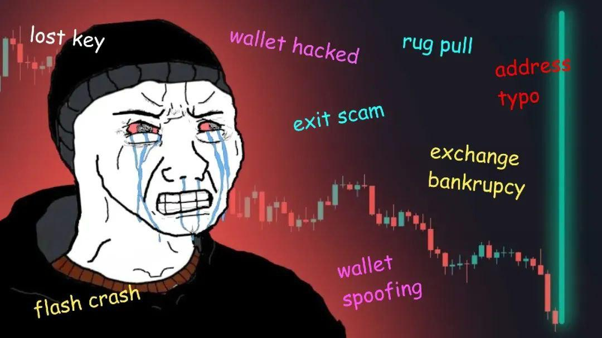

[](https://github.com/yyle88/gotrontrx/actions/workflows/release.yml?query=branch%3Amain)
[](https://pkg.go.dev/github.com/yyle88/gotrontrx)
[](https://coveralls.io/github/yyle88/gotrontrx?branch=main)
[](https://github.com/yyle88/gotrontrx)
[](https://github.com/yyle88/gotrontrx/releases)
[](https://goreportcard.com/report/github.com/yyle88/gotrontrx)

<p align="center">
  
</p>
<h3 align="center">golang-tron</h3>
<p align="center">create/sign <code>tron transaction</code> with golang</p>

---

# gotrontrx

`gotrontrx` is a Go toolkit exploring TRON blockchain tech without participating in crypto coins.

`gotrontrx` package interacts with the TRON network via a gRPC client, enabling developers to seamlessly execute the full workflow of transaction creation, signing, and broadcasting.

---

<!-- TEMPLATE (EN) BEGIN: LANGUAGE NAVIGATION -->
## CHINESE README

[中文说明](README.zh.md)
<!-- TEMPLATE (EN) END: LANGUAGE NAVIGATION -->

---

## Features

- **gRPC Client Support**: Establish connections with TRON nodes via gRPC, supporting both mainnet and testnet nodes.
- **Account and Transfer Operations**: Facilitate transactions, including specifying sender, recipient, and amount.
- **Transaction Signing**: Enable transaction signing using private keys to ensure security.
- **Transaction Broadcasting**: Broadcast signed transactions to the blockchain network.
- **Transaction Hash Calculation**: Provide tools for calculating transaction hashes.
- **Response Handling**: Offer structured processing of TRON gRPC API responses.

## Dependencies

- `github.com/fbsobreira/gotron-sdk`: Basic client of TRON gRPC APIs.
- `github.com/yyle88/gotrontrx`: Simple TRON operations.
- `neatjson`: Neat and structured output of information.
- `must`: Simple assertions in conditions.
- `rese`: Reduce boilerplate code for error handling.

## Installation

```bash
go get github.com/yyle88/gotrontrx
```

## Quick Start

Here are the primary functions:

- **`gotrongrpc.NewGrpcClient`**: Initialize a gRPC client to connect to TRON nodes.
- **`grpcClient.Transfer`**: Create a transfer transaction.
- **`gotronsign.Sign`**: Sign a transaction using a private key.
- **`grpcClient.Broadcast`**: Broadcast the signed transaction to the network.

`gotrontrx` allow developers to efficiently build TRON blockchain-based applications.

## Usage

### Basic TRX Transfer Transactions

This example shows the complete workflow of creating, signing, and broadcasting a TRX transfer transaction.

```go
package main

import (
	"encoding/base64"
	"flag"
	"fmt"

	"github.com/fbsobreira/gotron-sdk/pkg/client"
	"github.com/fbsobreira/gotron-sdk/pkg/proto/api"
	"github.com/fbsobreira/gotron-sdk/pkg/proto/core"
	"github.com/yyle88/gotrontrx/gotrongrpc"
	"github.com/yyle88/gotrontrx/gotronhash"
	"github.com/yyle88/gotrontrx/gotronsign"
	"github.com/yyle88/must"
	"github.com/yyle88/neatjson/neatjsons"
	"github.com/yyle88/rese"
	"google.golang.org/protobuf/encoding/protojson"
)

func main() {
	var grpcAddress string
	var fromAddress string
	var toAddress string
	var amount int64
	var privateKeyHex string

	flag.StringVar(&grpcAddress, "grpc", gotrongrpc.ShastaNetGrpc, "TRON node gRPC address")
	flag.StringVar(&fromAddress, "from", "", "Sender address")
	flag.StringVar(&toAddress, "to", "", "Recipient address")
	flag.Int64Var(&amount, "amount", 0, "Amount in base units")
	flag.StringVar(&privateKeyHex, "pk", "", "Private key hex")
	flag.Parse()

	// Display configuration parameters
	fmt.Println("grpc_address:", grpcAddress)
	fmt.Println("from_address:", fromAddress)
	fmt.Println("to_address:", toAddress)
	fmt.Println("amount:", amount)
	fmt.Println("private_key_hex_length:", len(privateKeyHex))

	// Validate required parameters are provided
	must.Nice(grpcAddress)
	must.Nice(fromAddress)
	must.Nice(toAddress)
	must.Nice(amount)
	must.Nice(privateKeyHex)

	// Connect to TRON network
	grpcClient := rese.P1(gotrongrpc.NewGrpcClient(grpcAddress))

	// Create TRX transaction
	rawTransaction := rese.P1(grpcClient.Transfer(
		fromAddress, // Sender wallet address
		toAddress,   // Recipient wallet address
		amount,      // Amount in base units
	))
	fmt.Println(neatjsons.S(rawTransaction))

	// Sign transaction with private key
	signature := signTransaction(privateKeyHex, rawTransaction.Transaction.RawData)

	// Broadcast signed transaction to network
	sendTransaction(grpcClient, rawTransaction.Transaction.RawData, signature)
}

func signTransaction(privateKeyHex string, txRaw *core.TransactionRaw) []byte {
	// Display transaction data in JSON format
	fmt.Println("tx_data:", neatjsons.SxB(rese.V1(protojson.Marshal(txRaw))))

	// Display transaction hash
	fmt.Println("tx_hash:", rese.C1(gotronhash.GetTxHash(txRaw)))

	// Generate ECDSA signature
	signature := rese.V1(gotronsign.Sign(privateKeyHex, txRaw))
	fmt.Println(len(signature))
	fmt.Println(base64.StdEncoding.EncodeToString(signature))
	return signature
}

func sendTransaction(grpcClient *client.GrpcClient, txRaw *core.TransactionRaw, signature []byte) {
	// Construct signed transaction
	signedTransaction := &core.Transaction{
		RawData:   txRaw,
		Signature: [][]byte{signature},
	}

	// Broadcast transaction to network
	resp := rese.P1(grpcClient.Broadcast(signedTransaction))
	fmt.Println(neatjsons.S(resp))

	// Validate broadcast response
	must.True(resp.GetResult())
	must.Equals(resp.Code, api.Return_SUCCESS)
	must.None(string(resp.Message))

	fmt.Println("success")
}
```

⬆️ **Source:** [Source](internal/demos/demo1x/main.go)

## Important Notes

1. **Security Precautions**: Never input your private key directly into the terminal in production environments to prevent leaks.
2. **Test Environment**: Use the testnet for debugging to avoid financial losses from unintended operations.
3. **Data Validation**: Ensure that input addresses and amounts are valid and compliant with TRON blockchain requirements.

## TRON Guide

`gotrontrx` package provides a straightforward introduction to TRON, along with essential knowledge for working with its blockchain.

### Step 1: Create a Wallet

You can generate a wallet offline using the following code:
https://gist.github.com/motopig/c680f53897429fd15f5b3ca9aa6f6ed2

Copy the code and run it on your local machine. Alternatively, you can use other offline tools for wallet creation.

**Important:** Blockchain wallets should always be created offline. Never use online services to generate private keys as they may not safe.

### Step 2: Check Wallet Information

Once the wallet is created, you can check its balance and information on the blockchain. For example, use the TRON testnet explorer website:
https://shasta.tronscan.org/#/address/TBYHGsFkshasvB3R6Zys4627h98owvUNFn

### Step 3: Obtain Test TRX

Developers can join the official TRON Telegram groups to request 5,000 TRX test tokens:
- Chinese Support: [TRON 官方中文客服群](https://t.me/TronOfficialTechSupport)
- English Support: [TRON Official Developers Group](https://t.me/TronOfficialDevelopersGroupEn)

Send the following message in either group to receive instructions:
```
!help
```

### Step 4: Use This SDK to Perform Transactions

Use a testnet wallet to try out the SDK features.

⬆️ **Source:** [Basic TRX Transfer Demo](internal/demos/demo1x/main.go)

---

## DISCLAIMER

Crypto coin, at its core, is nothing but a scam. It thrives on the concept of "air coins"—valueless digital assets—to exploit the hard-earned wealth of ordinary people, all under the guise of innovation and progress. This ecosystem is inherently devoid of fairness or justice.

For the elderly, cryptocurrencies present significant challenges and risks. The so-called "high-tech" façade often excludes them from understanding or engaging with these tools. Instead, they become easy targets for financial exploitation, stripped of the resources they worked a lifetime to accumulate.

The younger generation faces a different but equally insidious issue. By the time they have the opportunity to engage, the early adopters have already hoarded the lion's share of resources. The system is inherently tilted, offering little chance for new entrants to gain a fair footing.

The idea that cryptocurrencies like BTC, ETH, or TRX could replace global fiat currencies is nothing more than a pipe dream. This notion serves only as the shameless fantasy of early adopters, particularly those from the 1980s generation, who hoarded significant amounts of crypto coin before the general public even had an opportunity to participate.

Ask yourself this: would someone holding thousands, or even tens of thousands, of Bitcoin ever genuinely believe the system is fair? The answer is unequivocally no. These systems were never designed with fairness in mind but rather to entrench the advantages of a select few.

The rise of cryptocurrencies is not the endgame. It is inevitable that new innovations will emerge, replacing these deeply flawed systems. At this moment, my interest lies purely in understanding the underlying technology—nothing more, nothing less.

This project exists solely for the purpose of technical learning and exploration. The author of this project maintains a firm and unequivocal stance of *staunch resistance to cryptocurrencies*.

---

<!-- TEMPLATE (EN) BEGIN: STANDARD PROJECT FOOTER -->
<!-- VERSION 2025-09-26 07:39:27.188023 +0000 UTC -->

## 📄 License

MIT License. See [LICENSE](LICENSE).

---

## 🤝 Contributing

Contributions are welcome! Report bugs, suggest features, and contribute code:

- 🐛 **Found a mistake?** Open an issue on GitHub with reproduction steps
- 💡 **Have a feature idea?** Create an issue to discuss the suggestion
- 📖 **Documentation confusing?** Report it so we can improve
- 🚀 **Need new features?** Share the use cases to help us understand requirements
- ⚡ **Performance issue?** Help us optimize through reporting slow operations
- 🔧 **Configuration problem?** Ask questions about complex setups
- 📢 **Follow project progress?** Watch the repo to get new releases and features
- 🌟 **Success stories?** Share how this package improved the workflow
- 💬 **Feedback?** We welcome suggestions and comments

---

## 🔧 Development

New code contributions, follow this process:

1. **Fork**: Fork the repo on GitHub (using the webpage UI).
2. **Clone**: Clone the forked project (`git clone https://github.com/yourname/repo-name.git`).
3. **Navigate**: Navigate to the cloned project (`cd repo-name`)
4. **Branch**: Create a feature branch (`git checkout -b feature/xxx`).
5. **Code**: Implement the changes with comprehensive tests
6. **Testing**: (Golang project) Ensure tests pass (`go test ./...`) and follow Go code style conventions
7. **Documentation**: Update documentation to support client-facing changes and use significant commit messages
8. **Stage**: Stage changes (`git add .`)
9. **Commit**: Commit changes (`git commit -m "Add feature xxx"`) ensuring backward compatible code
10. **Push**: Push to the branch (`git push origin feature/xxx`).
11. **PR**: Open a merge request on GitHub (on the GitHub webpage) with detailed description.

Please ensure tests pass and include relevant documentation updates.

---

## 🌟 Support

Welcome to contribute to this project via submitting merge requests and reporting issues.

**Project Support:**

- ⭐ **Give GitHub stars** if this project helps you
- 🤝 **Share with teammates** and (golang) programming friends
- 📝 **Write tech blogs** about development tools and workflows - we provide content writing support
- 🌟 **Join the ecosystem** - committed to supporting open source and the (golang) development scene

**Have Fun Coding with this package!** 🎉🎉🎉

<!-- TEMPLATE (EN) END: STANDARD PROJECT FOOTER -->

---

## GitHub Stars

[](https://starchart.cc/yyle88/gotrontrx)
